# Документация VPN Platega Bot

Telegram-бот для продажи VPN-подписок: оплата через **Platega**, выдача ключей через **3x-ui**.

---

## Быстрая навигация

| Раздел | Описание |
|--------|----------|
| [Архитектура](architecture.md) | Два процесса, схема работы |
| [Установка](installation.md) | Python, venv, systemd |
| [Конфигурация](configuration.md) | Переменные `.env` |
| [Деплой](deployment.md) | Чеклист прода, nginx |
| [Системные требования](requirements.md) | VPS: CPU, RAM, диск по нагрузке |
| [3x-ui](xui.md) | Панель, подписка, утилиты |
| [Platega](platega.md) | Платежи и webhook |
| [Админка](admin.md) | Команда `/admin` |
| [Подписки](subscriptions.md) | Истечение, реактивация, возвраты |
| [Разработка](development.md) | TEST_MODE, логи, скрипты |
| [Troubleshooting](troubleshooting.md) | Решение типичных проблем |

---

## С чего начать

1. [Установка](installation.md) — поставить зависимости и скопировать `.env.example`
2. [Конфигурация](configuration.md) — заполнить токены и URL
3. [Деплой](deployment.md) — чеклист перед запуском в проде
4. [3x-ui](xui.md) + [Platega](platega.md) — подключить интеграции

Корневой [README.md](../README.md) — краткий quick start для репозитория.

---

## Порядок чтения

```mermaid
flowchart LR
    arch[architecture] --> install[installation]
    install --> config[configuration]
    config --> deploy[deployment]
    deploy --> reqs[requirements]
    reqs --> xui[xui]
    xui --> platega[platega]
    platega --> admin[admin]
    admin --> subs[subscriptions]
    subs --> dev[development]
    dev --> trouble[troubleshooting]
```

