# Документация VPN Platega Bot

Telegram-бот для продажи VPN-подписок: оплата через **Platega**, выдача ключей через **3x-ui**.

**Возможности:** тарифы, Platega, промокоды, trial, рефералы, FAQ, тикеты, мульти-ноды, Happ, hub-админка, техническая диагностика, lockdown, автобэкап.

---

## Быстрая навигация

| Раздел | Описание |
|--------|----------|
| [Архитектура](architecture.md) | Два процесса, Redis, lockdown, планировщик |
| [Установка](installation.md) | Python, venv, `vpn-bot-ctl.sh` (пункты 1–7) |
| [Конфигурация](configuration.md) | Переменные `.env`, Redis, рефералы |
| [Деплой](deployment.md) | Чеклист прода, обновление, nginx |
| [Системные требования](requirements.md) | VPS: CPU, RAM, диск |
| [3x-ui](xui.md) | Панель, подписка, синк нод |
| [Platega](platega.md) | Платежи и webhook |
| [Админка](admin.md) | Hub `/admin`, диагностика, отладка |
| [Подписки](subscriptions.md) | Истечение, рефералы, возвраты |
| [Разработка](development.md) | TEST_MODE, логи, скрипты |
| [Troubleshooting](troubleshooting.md) | Типичные проблемы |
| [Redis — план](redis-migration-plan.md) | FSM и сессии на Redis |
| [PostgreSQL — план](postgresql-migration-plan.md) | Опциональный переход БД бота |

---

## С чего начать

1. [Установка](installation.md) — venv и `.env`
2. [Конфигурация](configuration.md) — токены и URL
3. [Деплой](deployment.md) — чеклист прода
4. [3x-ui](xui.md) + [Platega](platega.md) — интеграции
5. [Админка](admin.md) — настройка после старта

Корневой [README.md](../README.md) — краткий quick start.

---

## Порядок чтения

```mermaid
flowchart LR
    arch[architecture] --> install[installation]
    install --> config[configuration]
    config --> deploy[deployment]
    deploy --> reqs[requirements]
    reqs --> xui[xui]
    xui --> platega[platega]
    platega --> admin[admin]
    admin --> subs[subscriptions]
    subs --> dev[development]
    dev --> trouble[troubleshooting]
```

