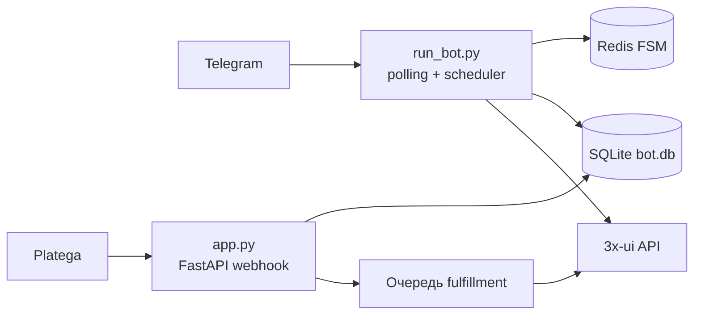

[← Документация](README.md) · [Установка](installation.md) · [Конфигурация](configuration.md) · [Деплой](deployment.md) · [3x-ui](xui.md) · [Platega](platega.md) · [Админка](admin.md) · [Подписки](subscriptions.md) · [Разработка](development.md) · [Troubleshooting](troubleshooting.md)

---

# Архитектура

В продакшене бот работает **двумя процессами**:

| Процесс | Файл | Задачи |
|---------|------|--------|
| Webhook | `python app.py` | Callback Platega, rate limit, идемпотентность, очередь выдачи ключей |
| Бот | `python run_bot.py` | Меню, оплата, админка, планировщик (истечение, sync нод, бэкап, напоминания) |
| Redis | `redis-server` | FSM aiogram при `REDIS_URL` — state/data диалогов вне RAM |

Без `REDIS_URL` FSM в памяти (`MemoryStorage`). В проде рекомендуется Redis — [Конфигурация](configuration.md).

## Способы запуска

| Команда | Когда |
|---------|--------|
| `python run_all.py` | Локально / VPS без systemd — одна команда, два процесса |
| `python app.py` + `python run_bot.py` | Продакшен с systemd (два unit) |
| `START_BOT_IN_WEBAPP=true` → `python app.py` | Отладка в одном процессе, **не для прода** |

Управление systemd: `sudo bash deploy/vpn-bot-ctl.sh` — см. [Установка](installation.md).

## Блокировка бота (lockdown)

Единый middleware [`bot/middlewares/maintenance_lockdown.py`](../bot/middlewares/maintenance_lockdown.py) и логика [`services/bot_lockdown.py`](../services/bot_lockdown.py).

| Режим | Условие | Поведение |
|-------|---------|-----------|
| **Выключено** | Primary OK, ручная блокировка выкл | Обыная работа |
| **Draining** | Ручная блокировка + есть PENDING-заказы | Новые оплаты заблокированы, текущие дорабатываются |
| **Полная ручная** | Ручная блокировка + PENDING = 0 | Бот недоступен (админы, whitelist, поддержка — да) |
| **Primary down** | ★ Primary недоступна | Автоблокировка для всех, кроме привилегированных |

**Поддержка** при lockdown: тикеты, refund, FSM `in_ticket_chat` — bypass middleware.

**Уведомление пользователям:** если включённая вторичная нода unhealthy — приписка в текстах ([`services/secondary_node_notice.py`](../services/secondary_node_notice.py)).

Управление: `/admin` → **Система** → **Отладка** → **Блокировка** (нужен `ALLOW_DEBUG_ADMIN=true`).

## Планировщик (`run_bot.py`)

| Задача | Интервал (дефолт) |
|--------|-------------------|
| Пульс / heartbeat | `LOG_HEARTBEAT_INTERVAL_MINUTES` |
| Health нод | 5 мин |
| Full sync нод | `FULL_SYNC_INTERVAL_HOURS` |
| Истечение подписок | `EXPIRED_CHECK_INTERVAL_HOURS` |
| Очистка истёкших на панели | `EXPIRED_PURGE_*` |
| Старые PENDING → failed | 6 ч |
| Напоминания о сроке | `EXPIRY_REMINDER_*` |
| Автобэкап | `BACKUP_INTERVAL` |

## База данных

- **SQLite** `data/bot.db` — заказы, подписки, тикеты, настройки runtime, ноды в БД.
- Опциональный переход на PostgreSQL — [план миграции](postgresql-migration-plan.md) (не реализован).

Два процесса делят один файл SQLite (WAL). Идемпотентность webhook — [`db/webhook_dedup.py`](../db/webhook_dedup.py).

---

**Далее:** [Установка →](installation.md)