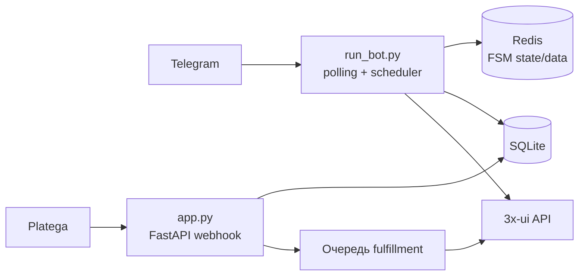

[← Документация](README.md) · [Установка](installation.md) · [Конфигурация](configuration.md) · [Деплой](deployment.md) · [3x-ui](xui.md) · [Platega](platega.md) · [Админка](admin.md) · [Подписки](subscriptions.md) · [Разработка](development.md) · [Troubleshooting](troubleshooting.md)

---

# Архитектура

В продакшене бот работает **двумя процессами**:

| Процесс | Файл | Задачи |
|---------|------|--------|
| Webhook | `python app.py` | Приём callback Platega, rate limit, идемпотентность, очередь выдачи ключей |
| Бот | `python run_bot.py` | Меню, оплата, админка, планировщик (истечение подписок, sync нод) |
| Redis | `redis-server` (localhost) | FSM aiogram при `REDIS_URL` — state/data диалогов вне RAM бота |

Без `REDIS_URL` FSM хранится в памяти процесса (`MemoryStorage`). В проде рекомендуется Redis — см. [Конфигурация → Redis](configuration.md).

**Способы запуска:**

| Команда | Когда использовать |
|---------|-------------------|
| `python run_all.py` | Локально и на VPS без systemd — одна команда, два процесса |
| `python app.py` + `python run_bot.py` | Продакшен с systemd (два unit-файла) |
| `START_BOT_IN_WEBAPP=true` → `python app.py` | Отладка в одном процессе, **не для прода** |

---

**Далее:** [Установка →](installation.md)