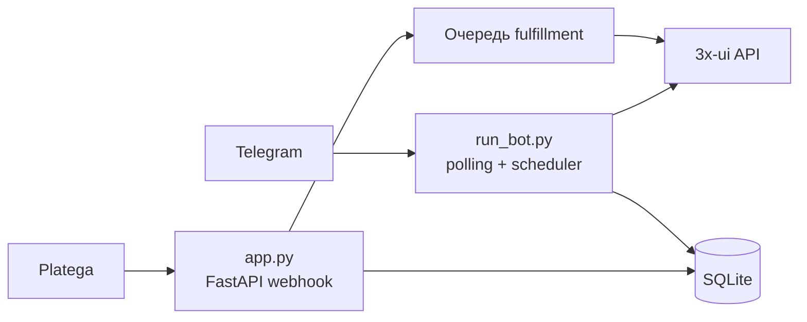

[← Документация](README.md) · [Установка](installation.md) · [Конфигурация](configuration.md) · [Деплой](deployment.md) · [3x-ui](xui.md) · [Platega](platega.md) · [Админка](admin.md) · [Подписки](subscriptions.md) · [Разработка](development.md) · [Troubleshooting](troubleshooting.md)

---

# Архитектура

В продакшене бот работает **двумя процессами**:

| Процесс | Файл | Задачи |
|---------|------|--------|
| Webhook | `python app.py` | Приём callback Platega, rate limit, идемпотентность, очередь выдачи ключей |
| Бот | `python run_bot.py` | Меню, оплата, админка, планировщик (истечение подписок, sync нод) |

`START_BOT_IN_WEBAPP=true` объединяет оба в одном процессе — удобно для отладки, **не рекомендуется** для прода.

---

**Далее:** [Установка →](installation.md)