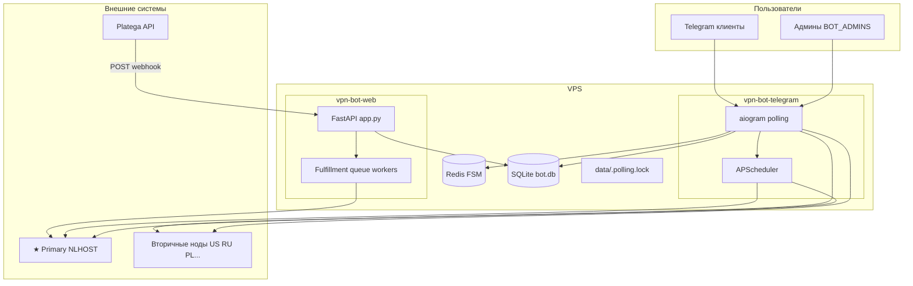
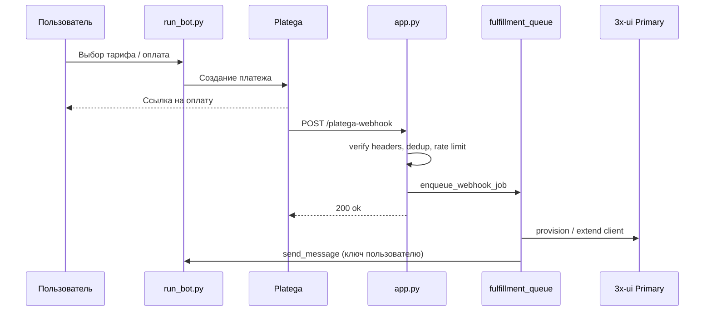

# Инфраструктура и механика бота — onboarding для новой сессии

Документ описывает **текущее состояние** проекта `vpn-platega-bot` (репозиторий [Sp0nge-bob/xuibot](https://github.com/Sp0nge-bob/xuibot)) на момент работы на VPS. Используйте его как точку входа в новой сессии с AI или для онбординга разработчика.

---

## 1. Что это за проект

**Telegram-бот** для продажи VPN-подписок:

| Компонент | Роль |
|-----------|------|
| **Platega** | Приём оплат (SBP, карта, крипто и др.) |
| **3x-ui** | Панели VPN: создание клиентов, инбаунды, подписки |
| **SQLite** | `data/bot.db` — заказы, подписки, ноды, настройки |
| **Redis** | FSM aiogram (диалоги админки/пользователей), если задан `REDIS_URL` |
| **FastAPI** | Webhook Platega + очередь выдачи ключей |

Пользовательский бренд в боте: **@caelixflowbot** (настраивается через `BOT_BRAND`, `BOT_TOKEN`).

---

## 2. Продакшен на VPS (текущая установка)

| Параметр | Значение |
|----------|----------|
| Каталог | `/root/vpn-platega-bot` (ctl предупреждает: лучше `/opt/vpn-bot`) |
| Пользователь служб | `vpnbot` |
| Git remote | `https://github.com/Sp0nge-bob/xuibot.git`, ветка `main` |
| Логи | `data/logs/bot.log` + `journalctl -u vpn-bot-telegram -u vpn-bot-web` |
| State deploy | `deploy/state.env` (пишется пунктом 1 ctl) |

### Systemd-службы

| Unit | Процесс | Файл |
|------|---------|------|
| `vpn-bot-telegram.service` | Polling + планировщик | `run_bot.py` |
| `vpn-bot-web.service` | Webhook + fulfillment | `app.py` |

Управление:

```bash
sudo bash deploy/vpn-bot-ctl.sh
# 1 — установить/обновить (+ Redis, sudoers)
# 2 — git pull + restart
# 3 — быстрый restart
# 4 — status
# 5 — логи tail -f
```

Перезапуск служб (скрипт для `/reboot`):

- `deploy/restart-services.sh` — сначала `vpn-bot-web`, потом `vpn-bot-telegram`
- Sudoers: `/etc/sudoers.d/vpn-bot-restart` — `vpnbot` может вызывать скрипт без пароля

---

## 3. Архитектура процессов



### Два процесса — зачем

| Процесс | Не делает |
|---------|-----------|
| `run_bot.py` | Не принимает HTTP webhook Platega (кроме `START_BOT_IN_WEBAPP=true`) |
| `app.py` | Не крутит polling (в проде `START_BOT_IN_WEBAPP=false`) |

Оба читают **один** `data/bot.db` (WAL). Webhook идемпотентен через `db/webhook_dedup.py`.

---

## 4. Старт бота (актуальная механика)

### 4.1 Telegram-процесс (`bot/start_bot` в `bot/__init__.py`)

**Быстрый путь (дефолт, `STARTUP_BLOCK_ON_ALL_NODES=false`):**

```
1. acquire_polling_lock()     → data/.polling.lock
2. ensure_primary_ready_at_startup()  → только ★ Primary (~1–2 с)
3. start_scheduler() + backup job
4. parallel: delete_webhook + get_me + setup_bot_commands
5. configure_dispatcher_storage (Redis/Memory)
6. "Polling started"
7. send_pending_reboot_notification()  → если был /reboot
8. create_task(_background_node_startup)  → фон
9. dp.start_polling()
```

**Фоновая задача `_background_node_startup`:**

- `initialize_nodes_at_startup(primary_result=..., background=True)`
- `run_full_nodes_sync(source="startup")` — если синк не выключен в админке
- `start_secondary_sync_workers()`

Ожидаемое время до **Polling started**: **~4–6 с** (не ждёт все ноды).

### 4.2 Webhook-процесс (`app.py` lifespan)

```
init_db → ensure_primary_ready_at_startup() → start_fulfillment_workers()
```

Polling в этом процессе **не** запускается (`START_BOT_IN_WEBAPP=false`).

### 4.3 Primary gate (`services/primary_gate.py`)

- Без рабочей **★ Primary** бот **не стартует** (RuntimeError в telegram-процессе).
- `/health` на webhook возвращает `503` если Primary недоступна.
- Middleware lockdown блокирует пользователей при падении Primary.

### 4.4 Инициализация нод (`services/node_startup.py`)

В фоне (или блокирующе при `STARTUP_BLOCK_ON_ALL_NODES=true`):

1. Health вторичных (Primary уже в `primary_result`, повторно не пингуется)
2. `log_inbound_port_conflicts()` на Primary
3. `ensure_bot_group_on_node` на healthy нодах
4. **Lazy-дубль:** `get_api_for_node` тоже вызывает `ensure_bot_group_on_node` при первом connect

### 4.5 Таймауты нод (дефолты в `config/settings.py`, .env не обязателен)

| Настройка | Дефолт | Где используется |
|-----------|--------|------------------|
| `STARTUP_NODE_TIMEOUT_SEC` | 25 с | Фоновый health при старте |
| `DIAGNOSTICS_NODE_TIMEOUT_SEC` | 25 с | Live-проверка в диагностике |
| `DIAGNOSTICS_TOTAL_TIMEOUT_SEC` | 120 с | Общий лимит сбора диагностики |
| `XUI_PANEL_CONCURRENCY` | 5 | Параллельные запросы к панелям |

Расчёт wall-time при N нодах: `services/node_probe_budget.py` — **волны** `ceil(N / concurrency) × per_node`.

Медленная нода **PL** (~15–25 с): увеличивать `DIAGNOSTICS_NODE_TIMEOUT_SEC` / `STARTUP_NODE_TIMEOUT_SEC` в `.env` при необходимости.

---

## 5. Поток оплаты и выдачи



Ключевые файлы:

| Файл | Назначение |
|------|------------|
| `services/payment_flow.py` | Создание заказа, выбор способа оплаты |
| `services/payment_processor.py` | Обработка статусов Platega |
| `services/fulfillment_queue.py` | Очередь воркеров в webhook-процессе |
| `services/fulfillment.py` | Выдача/продление на панели |
| `services/xui.py` | Unified API 3x-ui (clients/add, update, sync) |
| `bot/fulfillment_delivery.py` | Отправка сообщения с ключом в Telegram |

**Важно:** новая выдача идёт через **Primary** (`get_api()`). Вторичные ноды синхронизируются отдельно (`services/node_sync.py`).

---

## 6. Ноды 3x-ui

### Модель

| Тип | Роль |
|-----|------|
| **★ Primary** | Одна основная панель: создание клиентов, подписка, gate |
| **Вторичные** | Зеркала; синк клиентов с Primary |

Таблица `xui_nodes` в SQLite: host, token/login, `inbound_ids`, `is_primary`, `is_healthy`, latency, uptime.

### Синхронизация (`services/node_sync.py`)

- **Full sync** — по расписанию (`FULL_SYNC_INTERVAL_HOURS`) и при старте (если не выключен в админке).
- **Не прикрепляет** существующих клиентов к новому inbound автоматически при full sync (только новые операции / ручной attach).
- Воркеры вторичного синка: `XUI_SECONDARY_SYNC_WORKERS`.

### Health

- Планировщик: каждые **5 мин** (`check_nodes_health_job`)
- Алерты админам: `services/node_alerts.py`
- При unhealthy вторичной — приписка пользователям: `services/secondary_node_notice.py`

---

## 7. Админка

Вход: `/admin` (только `BOT_ADMINS` в `.env`).

### Hub-меню (`bot/admin_menu.py`)

Разделы: пользователи, тарифы, промокоды, ноды, FAQ, тикеты, платежи, бэкап, диагностика и др.

### Техническая диагностика

| UI | Код |
|----|-----|
| `bot/admin_diagnostics.py` | Роутер, кэш 45 с |
| `services/admin_diagnostics.py` | Сбор отчёта, форматирование |
| `services/diagnostics_nodes.py` | Live health + `server/status` за один проход |

Поведение кэша:

- **Сводка** — быстро, ноды из кэша БД
- **VPN** или **Обновить** — live-проверка нод + CPU/RAM
- Таймауты см. раздел 4.5

### Команда `/reboot` (только админ)

| Файл | Роль |
|------|------|
| `bot/admin_reboot.py` | Handler, приоритет над FSM и ActionLock |
| `bot/priority_commands.py` | Детектор `/reboot` |
| `bot/middlewares/action_lock.py` | Обход блокировки для `/reboot` |
| `services/bot_restart.py` | `sudo -n deploy/restart-services.sh` |
| `services/reboot_notify.py` | Уведомление после полного старта |

Механика:

1. Админ шлёт `/reboot` → сброс FSM, обход ActionLock
2. Сообщение «перезапускаю…» → запись в `bot_settings` (`reboot_notify_pending`)
3. `sudo` рестарт web + telegram
4. После `Polling started` — сообщение «✅ Перезапуск завершён»

Если event loop мёртв — только `vpn-bot-ctl.sh` пункт 3.

### Отладка (`ALLOW_DEBUG_ADMIN=true`)

`bot/admin_debug.py` — сброс trial, заказы (paid/failed), сообщение клиенту и др.

---

## 8. Middleware и блокировки

| Middleware | Файл | Эффект |
|------------|------|--------|
| `MaintenanceLockdownMiddleware` | `bot/middlewares/maintenance_lockdown.py` | Блок при lockdown / Primary down; админы проходят |
| `ActionLockMiddleware` | `bot/middlewares/action_lock.py` | Один handler на пользователя; debounce callback |

Lockdown: `services/bot_lockdown.py` + админка **Система → Отладка → Блокировка**.

Polling lock: `data/.polling.lock` — только один процесс polling (`bot/polling_lock.py`).

---

## 9. Планировщик (`bot/scheduler.py`)

Запускается в **telegram-процессе**.

| Job | Интервал (дефолт) |
|-----|-------------------|
| heartbeat | `LOG_HEARTBEAT_INTERVAL_MINUTES` |
| health нод | 5 мин |
| full sync нод | `FULL_SYNC_INTERVAL_HOURS` (24) |
| истечение подписок | `EXPIRED_CHECK_INTERVAL_HOURS` |
| очистка истёкших | `EXPIRED_PURGE_*` |
| pending → failed | 6 ч |
| напоминания о сроке | `EXPIRY_REMINDER_*` |
| автобэкап | из админки / `BACKUP_INTERVAL` |

---

## 10. Структура репозитория

```
vpn-platega-bot/
├── app.py                 # FastAPI webhook
├── run_bot.py             # Telegram entry
├── run_all.py             # Локально: оба процесса
├── config/
│   ├── settings.py        # Pydantic Settings (.env)
│   ├── plans.py           # Тарифы
│   └── logging_setup.py
├── bot/                   # aiogram: handlers, admin_*, middlewares
├── services/              # Бизнес-логика (xui, platega, fulfillment, diagnostics…)
├── db/                    # SQLite слой (database, xui_nodes, bot_settings…)
├── ui/                    # theme.screen(), тексты
├── deploy/
│   ├── vpn-bot-ctl.sh     # Меню управления
│   ├── restart-services.sh
│   └── lib/               # systemd, redis, permissions, sudoers
├── data/                  # bot.db, logs (не в git)
└── docs/                  # Документация
```

### Ключевые `services/`

| Модуль | Назначение |
|--------|------------|
| `xui.py` | API 3x-ui, кэш подключений, группы клиентов |
| `node_sync.py` | Синхронизация Primary → вторичные |
| `node_health.py` | Health check панелей |
| `primary_gate.py` | Гейт ★ Primary |
| `admin_diagnostics.py` | Технический отчёт |
| `fulfillment_queue.py` | Очередь webhook |
| `bot_lockdown.py` | Режим обслуживания |

---

## 11. Конфигурация (.env)

Минимум для прода (см. `.env.example`, [configuration.md](configuration.md)):

| Переменная | Назначение |
|------------|------------|
| `BOT_TOKEN` | Telegram |
| `BOT_ADMINS` | ID админов через запятую |
| `PLATEGA_*` | Merchant, secret, URL |
| `PUBLIC_WEBHOOK_URL` | HTTPS + путь webhook для Platega |
| `XUI_HOST` / token / login | Fallback Primary из .env |
| `REDIS_URL` | FSM (рекомендуется) |
| `START_BOT_IN_WEBAPP` | `false` в проде |
| `TEST_MODE` | `false` в проде |

Опциональные тюнинги (есть дефолты в коде):

- `STARTUP_BLOCK_ON_ALL_NODES` — `true` = старый медленный старт
- `STARTUP_NODE_TIMEOUT_SEC`, `DIAGNOSTICS_NODE_TIMEOUT_SEC`, `DIAGNOSTICS_TOTAL_TIMEOUT_SEC`
- `BOT_RESTART_SCRIPT`, `BOT_RESTART_CMD` — кастомный рестарт

---

## 12. Логи и отладка

```bash
# Все логи
sudo bash deploy/vpn-bot-ctl.sh  # → 5

# Или
tail -f /root/vpn-platega-bot/data/logs/bot.log
journalctl -u vpn-bot-telegram -u vpn-bot-web -f

# Health
curl -s http://127.0.0.1:8080/health | jq
```

Префиксы в `bot.log`: `bot` (telegram), `webhook` (app.py).

Типичные маркеры успешного старта:

```
★ Primary [NLHOST] готова
Polling started
Node startup (background): 5/5 нод готовы
```

---

## 13. Недавние изменения (контекст сессии)

Полезно знать при продолжении работы:

| Тема | Суть |
|------|------|
| Диагностика | Разделы proc/web/vpn/store/recs; CPU/RAM нод; таймауты; кэш сводки |
| `/reboot` | Приоритет над FSM/ActionLock; sudoers; notify после старта |
| Быстрый старт | Polling после Primary; ноды в фоне |
| Таймауты PL | 25 с/нода; бюджет по волнам concurrency |
| git pull на VPS | `chmod` на `deploy/restart-services.sh` — ctl сбрасывает дрейф |
| Debug заказы | Paid/failed, subscription_id, сообщение клиенту |
| FAQ | Подсказка про фото на шаге 1; sync builtin FAQ при старте |

---

## 14. Частые проблемы

| Симптом | Куда смотреть |
|---------|----------------|
| Бот не стартует | Primary gate, `journalctl -u vpn-bot-telegram` |
| Оплата не выдаёт ключ | `vpn-bot-web`, fulfillment workers, `/health` |
| Диагностика timeout на PL | Увеличить `DIAGNOSTICS_NODE_TIMEOUT_SEC` |
| `/reboot` «password required» | Пункт 1 ctl (sudoers), прямой запуск скрипта не через `bash` |
| git pull local changes | `git checkout -- deploy/restart-services.sh` |
| Два бота / lock | `data/.polling.lock`, один active telegram unit |
| Жёлтые иконки в диагностике | Был баг SQLite 0/1 — исправлен (`_as_ok`) |

Подробнее: [troubleshooting.md](troubleshooting.md).

---

## 15. Как продолжить в новой сессии (промпт)

Скопируйте в начало чата:

```
Проект: vpn-platega-bot (https://github.com/Sp0nge-bob/xuibot)
Документ: docs/infrastructure-and-mechanics.md
VPS: /root/vpn-platega-bot, systemd vpn-bot-telegram + vpn-bot-web, user vpnbot
Стек: aiogram + FastAPI + SQLite + Redis FSM + 3x-ui multi-node + Platega

Прочитай docs/infrastructure-and-mechanics.md и [задача].
```

---

## 16. Связанная документация

| Документ | Тема |
|----------|------|
| [architecture.md](architecture.md) | Краткая архитектура |
| [installation.md](installation.md) | Установка ctl |
| [admin.md](admin.md) | Админ-хаб |
| [xui.md](xui.md) | Панели и синк |
| [platega.md](platega.md) | Платежи |
| [troubleshooting.md](troubleshooting.md) | Решение проблем |