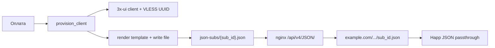

# JSON-подписки с балансировкой — план внедрения

См. также: [report/JSON_SUBSCRIPTIONS_DEEP_DIVE.md](../report/JSON_SUBSCRIPTIONS_DEEP_DIVE.md), [json-subscription-template-setup.md](json-subscription-template-setup.md).

## Цель

Переход с text-подписок 3x-ui на персональные JSON-конфиги Xray: каждая строка `subscriptions` получает свой статический `.json` файл, сгенерированный из админского шаблона при покупке/обновлении; ссылка для Happ указывает на nginx (`/api/v4/JSON/`), а не на `/api/v4/GET/{sub_id}`.

## Ключевые решения (согласовано)

- **Каждая купленная подписка** = свой JSON-URL (`tg{id}`, `tg{id}_2`, …)
- **Шаблон** — полная свобода: несколько балансеров, прямые outbound, смешанная схема; бот подставляет только `__UUID__`, `__REMARKS__`, …
- **Домен** — тот же `example.com`, путь `/api/v4/JSON/` (отдельно от webhook и панели)
- **Happ** — crypt3_local и crypt5_api; crypt4 не используется
- **Истечение/удаление** — JSON-файл удаляется (404)
- **Генерация** — при событиях (оплата, продление, смена шаблона), не на каждый HTTP-запрос

## Архитектура



## Конфигурация (.env, после реализации кода)

| Переменная | Пример |
|------------|--------|
| `JSON_SUBSCRIPTIONS_ENABLED` | `true` |
| `JSON_SUBSCRIPTION_BASE_URL` | `https://example.com/api/v4/JSON/` |
| `JSON_SUBSCRIPTION_STORAGE_DIR` | `/var/lib/vpn-bot/json-subs/` |

`SUBSCRIPTION_BASE_URL` остаётся fallback при `JSON_SUBSCRIPTIONS_ENABLED=false`.

## Плейсхолдеры шаблона

| Плейсхолдер | Источник |
|-------------|----------|
| `__UUID__` | `client.id` с панели (VLESS UUID) |
| `__REMARKS__` | `display_name` подписки |
| `__USER_ID__` | `tg_id` |
| `__CLIENT_EMAIL__` | `client_email` |
| `__CREATED_AT__` | ISO timestamp генерации |
| `__TEMPLATE_VERSION__` | версия шаблона в bot_settings |

## Nginx

```nginx
location /api/v4/JSON/ {
    alias /var/lib/vpn-bot/json-subs/;
    default_type application/json;
    add_header Content-Disposition 'attachment; filename="subscription.json"';
}
```

## Порядок PR-ов

1. Infrastructure — settings, `services/json_subscription.py`, `build_sub_link`, `vless_uuid`
2. Provisioning — UUID из `provision_client`, генерация при fulfill
3. Lifecycle — delete на expire/admin/refund
4. Admin UI — редактор шаблона + regen all
5. Migration script + regenerate для активных подписок

## Todos

- [ ] infra — Settings + json_subscription.py + build_sub_link + vless_uuid
- [ ] provision — UUID + generate on fulfill
- [ ] lifecycle — delete JSON on expire/admin/refund
- [ ] admin-ui — template editor, preview, regenerate-all
- [ ] migration — scripts/regenerate_json_subscriptions.py