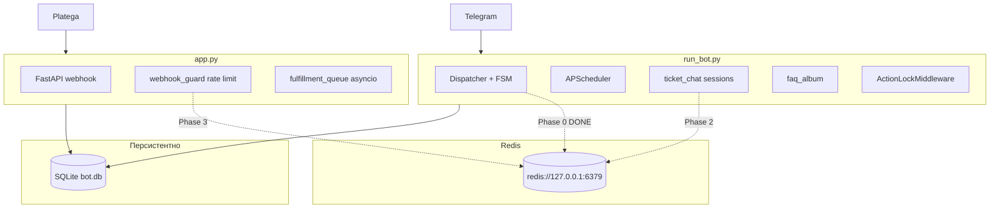
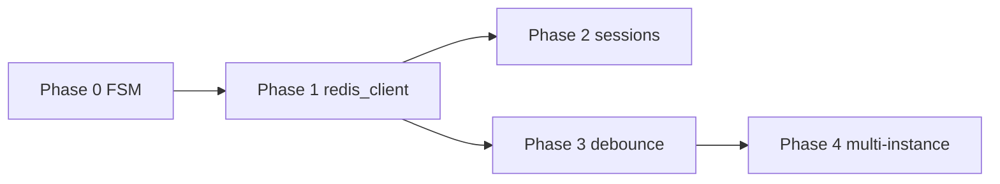

[← Документация](README.md) · [Архитектура](architecture.md) · [Конфигурация](configuration.md) · [Деплой](deployment.md) · [Troubleshooting](troubleshooting.md)

---

# План переноса бота на Redis

Поэтапный план с учётом двухпроцессной архитектуры (`run_bot.py` + `app.py`), уже реализованного FSM и границ того, что в Redis переносить не стоит.

**Главная цель:** уменьшить или полностью нейтрализовать пассивное накопление потребляемой ОЗУ процессами бота.

---

## Контекст проекта



| Процесс | Файл | Что держит в RAM |
|---------|------|------------------|
| Telegram | `run_bot.py` | FSM, ticket relay, FAQ album, action lock, promo debounce, subscription sync debounce, panel/happ кэши |
| Webhook | `app.py` | webhook rate limit (in-memory), asyncio fulfillment queue |
| Оба | SQLite | заказы, подписки, идемпотентность webhook (`db/webhook_dedup.py`) |

**Ограничения архитектуры:**

- Один polling-процесс — `bot/polling_lock.py` (файловый lock)
- Продакшен: venv `.venv/bin/pip`, не системный `pip` (PEP 668)
- `START_BOT_IN_WEBAPP=false` — FSM только в `run_bot.py`; webhook-процесс Redis для FSM не нужен
- Деплой: `deploy/vpn-bot-ctl.sh`, systemd unit-шаблоны

---

## Сводка фаз

| Фаза | Статус | Приоритет RAM | Описание |
|------|--------|---------------|----------|
| 0 | **Готово** | Высокий | FSM → RedisStorage с TTL |
| 1 | Запланировано | — | Общий `services/redis_client.py` |
| 2 | Запланировано | Средний | `ticket_chat`, `faq_album` → Redis |
| 3 | Запланировано | Низкий | debounce maps + webhook rate limit |
| 4 | Опционально | — | multi-instance (distributed lock) |

---

## Phase 0 — FSM (готово)

Реализовано в коммите `12251ac`.

### Файлы

| Файл | Изменение |
|------|-----------|
| `bot/fsm_storage.py` | `RedisStorage` с TTL при `REDIS_URL`, иначе `MemoryStorage` |
| `config/settings.py` | `REDIS_URL`, `FSM_STATE_TTL_SEC`, `FSM_DATA_TTL_SEC` |
| `bot/__init__.py` | Подключение storage перед polling, fail-fast ping |
| `bot/shutdown.py` | `close_fsm_storage()` |
| `deploy/systemd/vpn-bot-telegram.service.template` | `After=redis-server.service` |
| `requirements.txt`, `pyproject.toml` | `redis>=5.0.0` |

### Продакшен

Достаточно одной переменной в `.env`:

```env
REDIS_URL=redis://127.0.0.1:6379/0
```

`FSM_STATE_TTL_SEC` и `FSM_DATA_TTL_SEC` по умолчанию 86400 (24 ч) — менять не обязательно.

### Установка Redis

**Автоматически** (Debian/Ubuntu) — пункт **1** в `deploy/vpn-bot-ctl.sh`:

- `apt install redis-server`
- `systemctl enable` + `start`
- проверка `redis-cli ping` → PONG
- если в `.env` нет `REDIS_URL` — добавляет `REDIS_URL=redis://127.0.0.1:6379/0`

Реализация: [`deploy/lib/redis.sh`](../deploy/lib/redis.sh).

**Вручную:**

```bash
sudo apt update && sudo apt install -y redis-server
sudo systemctl enable redis-server
redis-cli ping   # PONG
```

### Деплой

```bash
cd ~/vpn-platega-bot
git pull
.venv/bin/pip install -r requirements.txt
sudo bash deploy/vpn-bot-ctl.sh
# → 1   (redis + venv + unit-файлы)
# или → 2   (только restart)
journalctl -u vpn-bot-telegram -n 30 --no-pager | grep -i fsm
```

Пункт **3** (статус) показывает блок Redis: PONG / REDIS_URL в `.env`.

В логах: `FSM storage: Redis (TTL state=86400s, data=86400s)`.

### Откат

Убрать `REDIS_URL` из `.env` и перезапустить — снова `MemoryStorage`.

### Эффект

Нейтрализует главный источник пассивного роста RAM — бесконечное накопление FSM state/data у всех пользователей, когда-либо входивших в диалог (промокод, админ-wizard, тикеты, ноды).

### Чеклист регрессии

- [ ] Промокод: ввод → применение / отмена через меню
- [ ] Checkout с именем подписки
- [ ] Админ: wizard промо (discount/grant)
- [ ] Админ: создание ноды (`node_draft` через несколько шагов)
- [ ] Админ: FAQ с фото
- [ ] Тикет relay (`ticket_chat_id` в FSM state)
- [ ] `/start` и «Главное меню» сбрасывают FSM

---

## Phase 1 — Общий Redis-клиент

**Цель:** один пул соединений на процесс, единые key-prefixes, переиспользование в фазах 2–3.

### Новый файл: `services/redis_client.py`

- `get_redis()` — lazy singleton `redis.asyncio.Redis` из `REDIS_URL`
- `redis_enabled()` — `bool(REDIS_URL.strip())`
- `ping_redis()` — health-check
- `close_redis()` — в shutdown обоих процессов
- Константы префиксов: `fsm:` (уже в aiogram), `sess:`, `rl:`, `debounce:`

### Изменения

| Файл | Действие |
|------|----------|
| `bot/shutdown.py` | `close_redis()` после FSM |
| `app.py` | `close_redis()` в lifespan при остановке webhook |
| `bot/fsm_storage.py` | Опционально: общий пул (не обязательно) |

### Настройки

Без новых env-переменных — всё через `REDIS_URL`.

### Критерий готовности

- [ ] Один Redis-пул на процесс
- [ ] Корректное закрытие при SIGTERM обоих служб
- [ ] `redis_enabled()` используется в фазах 2–3

---

## Phase 2 — Эфемерные сессии Telegram

Переносить только при `REDIS_URL`; иначе — текущие dict.

| Модуль | Сейчас | Redis-ключ | TTL |
|--------|--------|------------|-----|
| `bot/ticket_chat.py` | `_active_sessions: dict[int,int]` | `sess:ticket:{tg_id}` → ticket_id | 24 ч |
| `bot/faq_album.py` | `_album_message_ids: dict[int,list]` | `sess:faq_album:{chat_id}` → JSON list[int] | 1 ч |

**Почему:** вторичный источник роста RAM; чистится на `/start` и главном меню (`bot/handlers.py`), но dict растёт между очистками при активном трафике.

### Подход

- Абстракции `TicketSessionStore` / `FaqAlbumStore` с реализациями `Memory` и `Redis`
- Публичный API без изменения сигнатур: `set_active_session`, `get_active_session`, `clear_active_session`, `set_faq_album_message_ids`, `clear_faq_album`
- TTL обновлять при каждой записи (`EXPIRE`)

### Риск

Минимальный — данные эфемерные; потеря при рестарте Redis = пользователь заново открывает тикет/FAQ.

### Когда делать

Если RSS `run_bot.py` всё ещё растёт через 72 ч после Phase 0.

### Чеклист регрессии

- [ ] Пользователь: тикет → сообщение → выход в меню → relay не срабатывает
- [ ] FAQ с альбомом → выход → сообщения удаляются
- [ ] Админ relay по тикету

---

## Phase 3 — Rate-limit / debounce maps

Уже ограничены в коде (cap 10k / prune), но живут в RAM до рестарта.

| Модуль | Процесс | Redis-паттерн | TTL |
|--------|---------|---------------|-----|
| `services/promo_redeem.py` | Telegram | `debounce:promo:{tg_id}` | `PROMO_REDEEM_COOLDOWN_SEC * 20` |
| `services/subscription_sync.py` | Telegram | `debounce:subsync:{tg_id}` | `SUBSCRIPTION_SYNC_DEBOUNCE_SEC * 20` |
| `services/webhook_guard.py` | Webhook | `rl:webhook:{ip}` sliding window | 60 с |

**Особенность webhook:** rate limit in-memory в `app.py`; при рестарте счётчики сбрасываются — Redis даст стабильность.

### Не переносить

| Модуль | Причина |
|--------|---------|
| `bot/middlewares/action_lock.py` `_processing` | живёт секунды, строго per-process |
| `_last_callback` debounce | cap 5000, prune есть; Redis нужен только при нескольких polling-инстансах |

### Дополнительно

- `deploy/systemd/vpn-bot-web.service.template` — `Wants=redis-server.service`

### Когда делать

- Нужна стабильность webhook rate limit между рестартами
- Или как страховка плато RAM при росте базы

### Чеклист регрессии

- [ ] Двойной ввод промокода < 3 с → отклонение
- [ ] Повторный webhook с одного IP > лимита → 429
- [ ] «Мои подписки» — debounce sync не ломает refresh

---

## Phase 4 — Multi-instance (опционально)

Только при горизонтальном масштабировании (2+ VPS / несколько polling).

| Компонент | Сейчас | Redis-решение |
|-----------|--------|---------------|
| `bot/polling_lock.py` | файл `.polling.lock` | `SET bot:polling_lock NX EX 30` + heartbeat |
| FSM concurrency | один процесс | `RedisEventIsolation` в Dispatcher |
| ActionLock debounce | in-memory | Redis SET с TTL |
| Webhook fulfillment | asyncio.Queue | оставить или Redis Stream / Celery (большой scope) |

**Важно:** два polling-процесса с одним `BOT_TOKEN` без distributed lock → `TelegramConflictError`. Phase 4 — только вместе с lock + event isolation.

---

## Что намеренно НЕ переносить в Redis

| Компонент | Причина |
|-----------|---------|
| SQLite (`db/`) | источник истины: заказы, подписки, промо, тикеты |
| `db/webhook_dedup.py` | идемпотентность webhook уже в SQLite, надёжнее |
| `services/fulfillment_queue.py` | asyncio.Queue, живёт секунды, один webhook-процесс |
| `services/panel_cache.py` | тяжёлые объекты API 3x-ui; Redis = сериализация + latency |
| `services/happ_crypto.py` | bounded 2000 entries, performance cache |
| `services/node_alerts.py` | малый dict по числу нод |
| `bot/scheduler.py` (APScheduler) | RedisJobStore избыточен для одного VPS |

---

## Инфраструктура Redis

### Рекомендуемый `/etc/redis/redis.conf`

```
bind 127.0.0.1 ::1
maxmemory 128mb
maxmemory-policy allkeys-lru
```

Опционально для чисто ephemeral данных: `save ""` (отключить RDB).

С паролем: `requirepass` → URL `redis://:password@127.0.0.1:6379/0`

### systemd

| Unit | Зависимость |
|------|-------------|
| `vpn-bot-telegram` | `After=redis-server.service` (уже есть) |
| `vpn-bot-web` | `Wants=redis-server.service` (при Phase 3) |

### Мониторинг (опционально)

Расширить `bot/admin_diagnostics.py` или статистику:

- `used_memory_human`, количество ключей по prefix
- статус FSM backend (Redis / Memory)
- сравнение RSS `run_bot.py` до/после (админка → статистика)

---

## Стратегия внедрения



**Принципы каждой фазы:**

1. `REDIS_URL` пуст → поведение 1:1 с текущим in-memory
2. `REDIS_URL` задан + Redis недоступен → fail-fast при старте
3. Один PR = одна фаза, отдельный чеклист регрессии
4. Откат: убрать `REDIS_URL` (для FSM — полный откат на Memory)

---

## Ожидаемый эффект по RAM

| Фаза | Вклад в пассивный рост RAM |
|------|---------------------------|
| Phase 0 FSM | **Высокий** — основная цель |
| Phase 2 sessions | Средний — при активных тикетах/FAQ |
| Phase 3 debounce | Низкий — уже bounded, стабилизирует плато |
| Phase 4 | Не про RAM, про масштабирование |

После Phase 0 + bounded maps (коммит `a1b0f45`) RSS `run_bot.py` должен выйти на плато ~300–400 MB. Phase 2–3 — страховка при росте базы.

---

## Рекомендуемый порядок

1. **Сейчас** — Phase 0: `REDIS_URL` в `.env` (код уже в репозитории)
2. **Через 72 ч** — сравнить RSS; если растёт → Phase 2
3. **По необходимости** — Phase 3 (webhook rate limit между рестартами)
4. **При масштабировании** — Phase 4

Phase 1 делать **перед** Phase 2–3, чтобы не плодить отдельные Redis-подключения.

---

**Назад:** [← Документация](README.md)